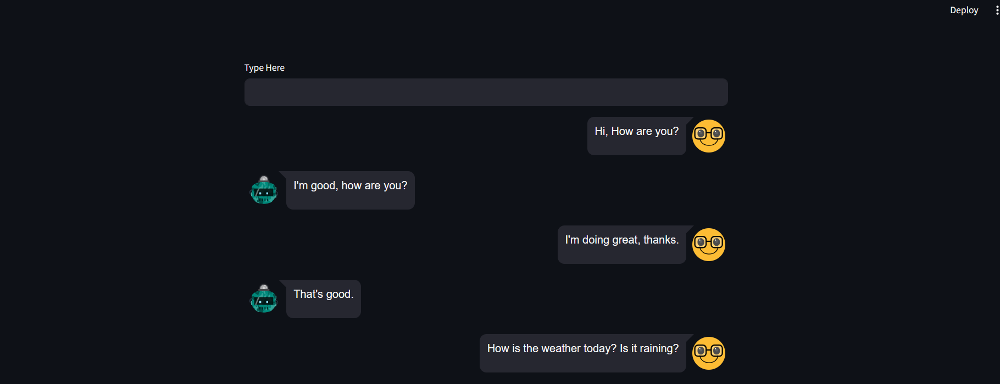
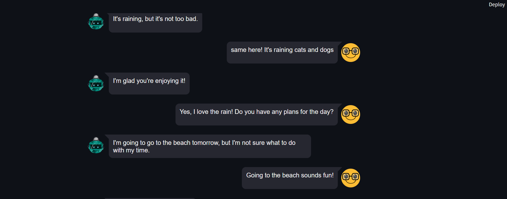

## Chatbot with DialoGPT and Streamlit
This project showcases the seamless integration of Streamlit with DialoGPT, a state-of-the-art conversational AI model available in Hugging Face's Transformers library. The chatbot created through this integration provides users with an interactive and engaging platform to converse with the AI model.

The primary goal of this project is to demonstrate the power and versatility of combining Streamlit, a popular Python library for creating web applications, with DialoGPT, an advanced language model capable of generating human-like responses. The chatbot offers users a natural and intuitive conversational experience by leveraging these technologies.

## Features
- User-friendly interface powered by Streamlit
- Integration with DialoGPT for conversational capabilities

## ChatBot

## Acknowledgments
- Streamlit for the user-friendly app framework
- Hugging Face Transformers for the DialoGPT model

